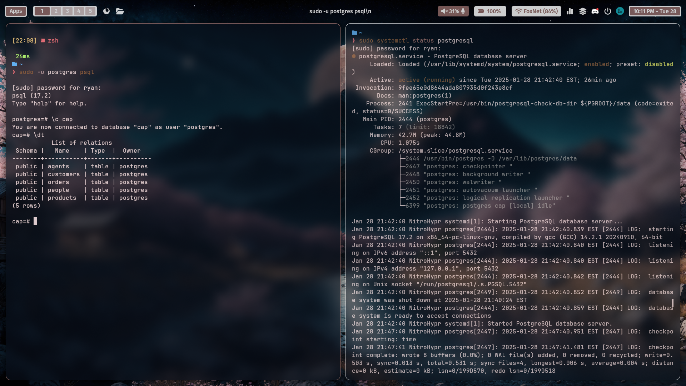

# Database Lab 1 Report 

**Course:** Database Management\
**Lab Number:** *Lab 1*\
**Date:** *2024-01-29*\
**Name:** *Ryan Munger*

---

## 1. Objective
* Install PostgreSQL and pgAdmin4.
* Practice getting around in the PostgreSQL and pgAdmin environments.
* Practice getting around in and using GitHub.
* Explain some key concepts we covered in class.
* Get some easy lab points.

## 2. Lab Setup

*No setup required aside from a PostgreSQL installation.*

## 3. Procedure

### Part 1: *Install PostgreSQL and a DB manager*

I will be using psql to manage my database instead of pgAdmin4. The screenshot below shows that psql is working and that PostgreSQL is running on my system. (I fixed my wallpaper config just for this screenshot btw - thanks for the motivation).

### Part 2: *Data vs Information*

Data and information are related but the distinction between them is important. Data refers to 'raw' facts/figures such as numbers and text that on their own do not mean anything. One such example is the set: [12, 25, 15, 33]. Information, (the thing we strive to possess), is data with context added. Context turns data into information and transforms figures into metrics/measurements. The dataset mentioned previously would become information if context such as a unit of measurement or description was added. That set could be temperature data for the month of January in Poughkeepsie.

### Part 3: *Data Models*

*Briefly describe the hierarchical and network pre-relational data models. Explain their shortcomings in relation to the relational model. Considering this, what do you think of XML as a model for data storage?*

Hierarchical data models work by storing data in trees. This creates a hierarchy (obviously). Some critical issues with this type of data representation include duplicate nodes, disconnected nodes, and more complex querying procedures. The network data model, not to be confused with the graph model, allows more flexibility than the H-model and removes the issue of duplicate nodes. The disconnection and query problems still persist though. An even worse implication of these models is that any modifications to the data itself may necessitate changes to your code/queries :(.
 
 
My thoughts on XML data storage: it is alright I guess. JSON is better in terms of object storage, but I have used XML many times. It is organized, VERY VERBOSE, and can be read/written by many different languages/tooling. I made some gauges for a project I cannot speak about, and this GUI was driven by XML. I have nightmares to this day.
