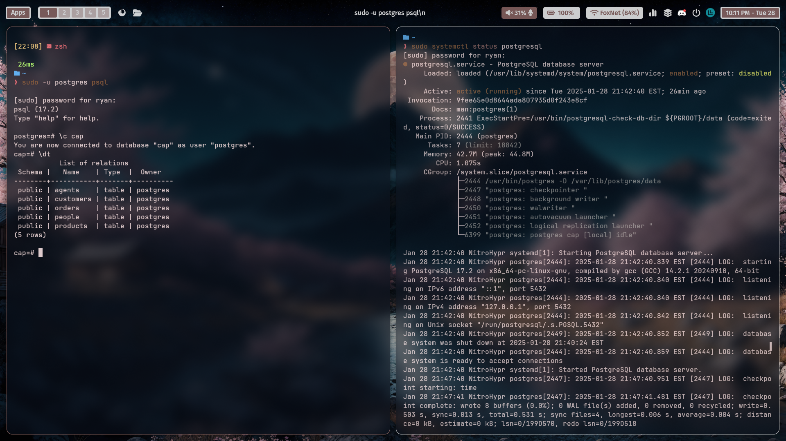

# Database Lab 1 Report 

**Course:** Database Management\
**Lab Number:** *Lab 1*\
**Date:** *2024-01-29*\
**Name:** *Ryan Munger*

---

## 1. Objective
* Install PostgreSQL and pgAdmin4.
* Practice getting around in the PostgreSQL and pgAdmin environments.
* Practice getting around in and using GitHub.
* Explain some key concepts we covered in class.
* Get some easy lab points.

## 2. Lab Setup

*No setup required aside from a PostgreSQL installation.*

## 3. Procedure

### Part 1: *Install PostgreSQL and a DB manager*

I will be using psql to manage my database instead of pgAdmin4. The screenshot below shows that psql is working and that PostgreSQL is running on my system. (I fixed my wallpaper config just for this screenshot btw - thanks for the motivation).

### Part 2: *Data vs Information*

Mini Essay

### Part 3: *Data Models*

Mini Essay
