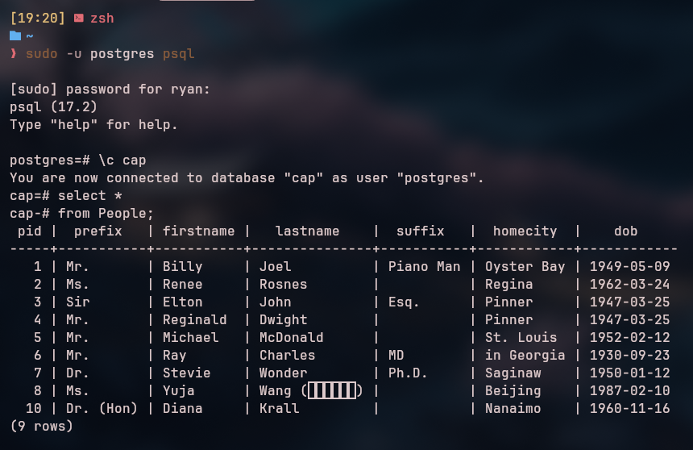
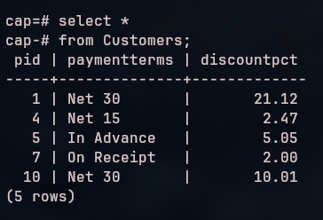
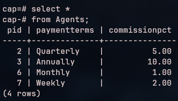
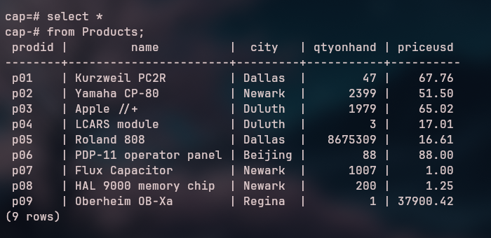
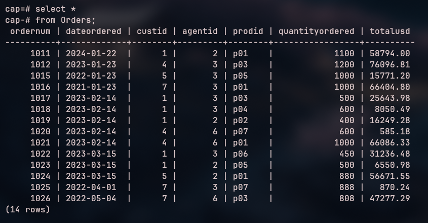

# Database Lab 2 Report

**Course:** Database Management\
**Lab Number:** *Lab 2*\
**Date:** *2025-01-29*\
**Name:** *Ryan Munger*

---

## 1. Objective
* More practice getting around in the PostgreSQL and pgAdmin environments.
* Familiarize yourself with the CAP database data.
* Get more easy lab points.

## 2. Lab Setup

*Create the CAP database in PostgreSQL.*

## 3. Procedure

### Part 1: *Querying CAP*

*Execute the following queries (one at a time), take a screenshot, and verify its correctness.*

```sql
select *
from People;
```


```sql
select *
from Customers;
```



```sql
select *
from Agents;
```



```sql
select *
from Products;
```



```sql
select *
from Orders
```



### Part 2: *Keys*

*Explain the distinctions among the terms primary key, candidate key, and superkey.*

A superkey is any field or set of fields in a table that can uniquely identify every row in said table. It often has unnecessary attributes. <br>

A candidate key is a minimal superkey. Like the superkey, it can uniquely identify each row in the table. "Minimal superkey" means that it is the superkey with a small set of columns/attributes required to ensure the uniqueness. <br>

The primary key is the candidate key selected to provide uniqueness. The primary key is the most minimal candidate and can be used for table relations. The primary keys should not be null nor should they be defined by the user. We should use artificial keys like CWID wherever possible. <br>

Summary: superkey is any set of fields that ensures uniqueness, candidate key is minimal superkey, and primary key is the best candidate key.

### Part 3: *Data Types*

*Write a short essay on data types. Select a topic for which you might create a table.
Name the table and list its fields (columns). For each field, give its data type and whether or not it is nullable*

Data types good. Essay done. Despite the obvious value of data types, we need to appreciate that they restrict the kind of data that can be stored in each column of a table. The data in each column fits specific format and is comparable. Common data types in databases include integers, floating-point numbers, strings, dates, and booleans. <br>
Topic: Job applicants (its always on my mind...)

Applicants: (This isn't a DB table its a reverse table describing the columns)
| Field Name          | Data Type           | Nullable | Description                                        |
|---------------------|---------------------|----------|----------------------------------------------------|
| `applicant_id`      | `INT`               | No       | Unique applicant identifier (Primary Key) |
| `first_name`        | `STRING`        | No       | First name |
| `last_name`         | `STRING`        | No       | Last name  |
| `email`             | `STRING`       | No       | Email      |
| `phone_number`      | `STRING`        | Yes      | Phone - not required |
| `position_applied`  | `STRING`       | No       | Position applied for |
| `application_date`  | `DATE`               | No       | Date application was submitted |
| `cover_letter`      | `TEXT`               | Yes      | Cover letter - optional |

### Part 4: *Relational Rules*

1. First Normal Form
    1. This rule dictates that there are to be no multi-valued attributes or values with internal structure at any intersection of a row and a column in a table (original description... definitely not the slides talking). All values at the intersection must be atomic (cannot be divided further). An example of this would be a column for email that has someone's home and work emails both listed separated by a comma. This field is not atomic, and should be divided into "home_email" and "work_email" attributes. 
1. Access Rows by Content Only
    1. This rule states that data should be queried based on *what it is* (content) rather than *where is is* (row/col). For example, querying "What is the first name of pid 007?" is valid because this is content based and will work no matter how the table is ordered. However, asking, "What is the name in the first row?" references an arbitrary and temporary table location. As new data is added, the table is ordered, or defragmentation occurs, the table rows will shift positions. Your location based query will no longer work (or even worse - return a different record!).
1. All Rows must be Unique
    1. This rule declares (without trumpets) that all rows need to be distinguishable from every other row. The uniqueness of rows is essential to data integrity and querying. For example, if two rows were the same, it would be unclear which row a query actually pertained to. This rule is not as heavily enforced, as we saw in class. However, restrictions such as primary keys will often prevent duplicate rows from being created.

