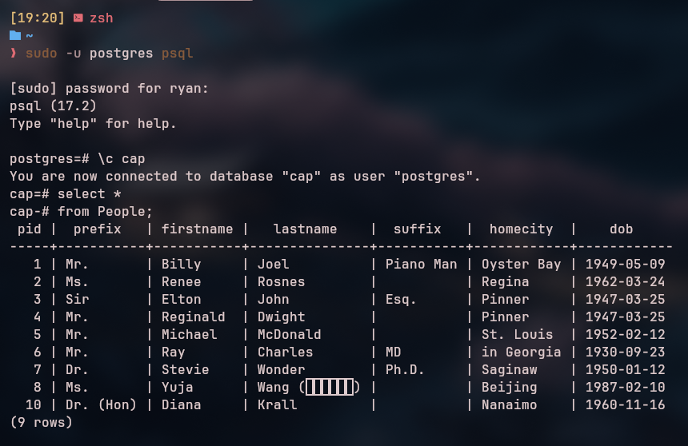
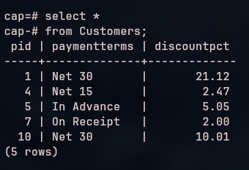
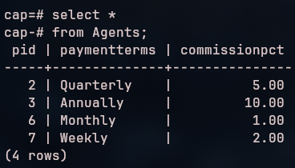
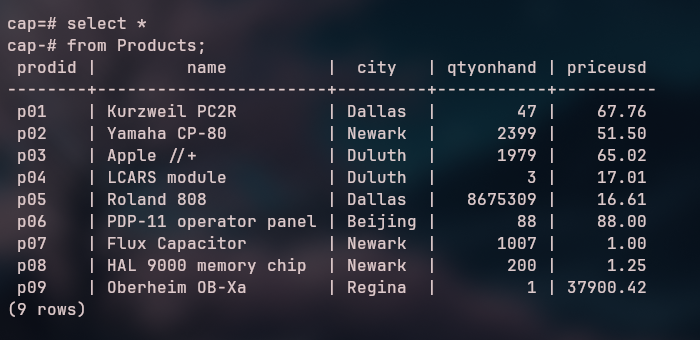
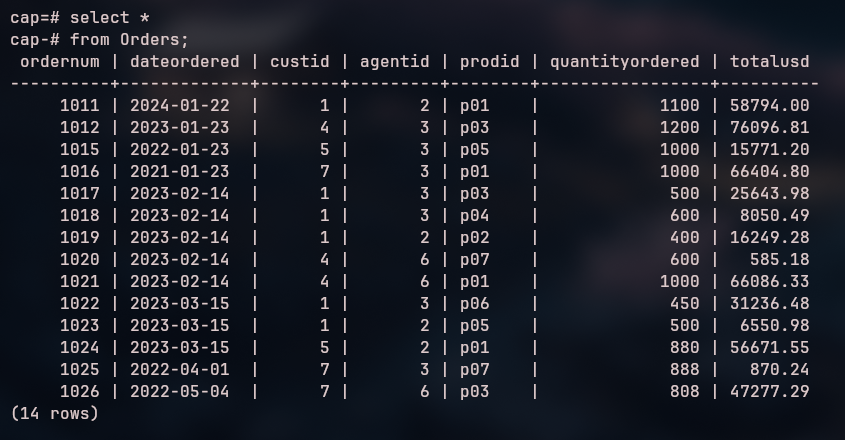

# Database Lab 2 Report

**Course:** Database Management\
**Lab Number:** *Lab 2*\
**Date:** *2024-01-29*\
**Name:** *Ryan Munger*

---

## 1. Objective
* More practice getting around in the PostgreSQL and pgAdmin environments.
* Familiarize yourself with the CAP database data.
* Get more easy lab points.

## 2. Lab Setup

*Create the CAP database in PostgreSQL.*

## 3. Procedure

### Part 1: *Querying CAP*

*Execute the following queries (one at a time), take a screenshot, and verify its correctness.*

```sql
select *
from People;
```


```sql
select *
from Customers;
```



```sql
select *
from Agents;
```



```sql
select *
from Products;
```



```sql
select *
from Orders
```



### Part 2: *Keys*

*Explain the distinctions among the terms primary key, candidate key, and superkey.*

Answer


### Part 3: *Data Types*

*Write a short essay on data types. Select a topic for which you might create a table.
Name the table and list its fields (columns). For each field, give its data type and whether or not it is nullable*


### Part 4: *Relational Rules*

1. First Normal Form
1. Access Rows by Content Only
1. All Rows must be Unique

