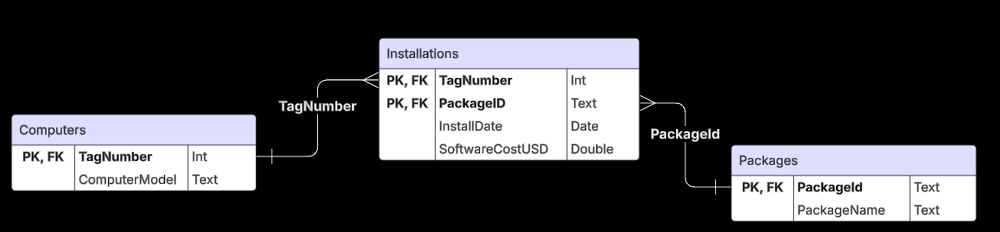

# Database Lab Report 6

**Course:** Database Management\
**Lab Number:** *Lab #7*\
**Date:** *2025-25-25*\
**Name:** *Ryan Munger*

---

## 1. Objective

*To begin delving into the art and science of relational database normalization.*

## 2. Lab Setup

*A normalized brain*

## 3. Procedure

### Prompt: 

*You have been hired as a database consultant by Tycho Manufacturing. They wish to
track the software packages installed on their station computers. Each computer is
identified by an asset tag number. Each software package has a package ID. They would
also like to track the installation date of each package on each computer, as well as the
cost of that software for that computer at install time.*

### Part 1:
*Tycho CEO Fred Johnson has put together a spreadsheet of all the data he has so far, which he personally collected.* 

​1.  **As he shows you the spreadsheet, having just signed your consulting agreement, he asks what you think of it. How do you reply?**

I would applaud him for his efforts on bookkeeping. However, I would inform him of some key issues and let him know I plan to resolve them. Firstly, we need to get the data normalized so that we can query it as well as use it as a reliable source of truth. The current format is not queryable or scalable. There is not a great way of identifying unique values either.

\
2. **Put his data in 1NF and display it. (Show me the table; no SQL.)**

To get his data in 1NF, we need to ensure each field has an atomic value and ensure a primary key.

| PackageID | TagNumber | InstallDate | SoftwareCostUSD |
|-----------|----------|-------------|----------------|
| AC01      | 32808    | 09-13-2005   | 754.95         |
| DB32      | 32808    | 12-03-2005   | 380.00         |
| DB32      | 37691    | 06-15-2005   | 380.00         |
| DB33      | 57772    | 05-27-2005   | 412.77         |
| WP08      | 32808    | 01-12-2006   | 185.00         |
| WP08      | 37691    | 06-15-2005   | 227.50         |
| WP08      | 57222    | 05-27-2005   | 170.24         |
| WP09      | 59836    | 10-30-2005   | 35.00          |
| WP09      | 77740    | 05-27-2005   | 35.00          |

  
3. **What is the primary key?**

Unfortunately, TagNumber alone is not a primary key as there are multiple installations for the same computer. Instead, using only the data present in the table, I would select a combination of PackageID and TagNumber to be our primary key to uniquely identify each installation. 

### Part 2:
*Add two columns of new data: one column for software package name (e.g.,
Zork, Portal, etc.) and one for computer model (e.g., IBM, Apple, etc.). Be sure that your
new data is consistent with the original data. Do not add any additional columns.*

\
4. **Display the new table.** \
We need to ensure that the computer model is the same for all instances of a specific TagNumber and that PackageName is the same for all instances of a specific PackageID.

| PackageID | TagNumber | InstallDate | SoftwareCostUSD | PackageName | ComputerModel |
|-----------|----------|-------------|-----------|---------|--------|
| AC01      | 32808    | 09-13-2005   | 754.95   | Alab    | Apple  |
| DB32      | 32808    | 12-03-2005   | 380.00   | Gopiler | Apple  |
| DB32      | 37691    | 06-15-2005   | 380.00   | Gopiler | Lenovo |
| DB33      | 57772    | 05-27-2005   | 412.77   | Solitaire | Dell |
| WP08      | 32808    | 01-12-2006   | 185.00   | Tsiram  | Apple  | 
| WP08      | 37691    | 06-15-2005   | 227.50   | Tsiram  | Lenovo |
| WP08      | 57222    | 05-27-2005   | 170.24   | Tsiram  | MSI   |
| WP09      | 59836    | 10-30-2005   | 35.00    | Snake  | Acer   |
| WP09      | 77740    | 05-27-2005   | 35.00    | Snake  | HP     | 

.1. **Identify and document all functional dependencies.**

PackageID → PackageName

    Each PackageID uniquely determines a PackageName.

    A PackageID will always correspond to one and only one PackageName.

TagNumber → ComputerModel

    Each TagNumber is related to a single ComputerModel.

    If we know the TagNumber, we know the model of the computer.

(PackageID, TagNumber) → InstallDate, SoftwareCostUSD

    The combination of PackageID and TagNumber is the primary key.

PackageName !→ PackageID 

    Multiple PackageIDs can have the same PackageName.

ComputerModel !→ TagNumber 

    Multiple TagNumbers can share the same ComputerModel.
\
6. **Explain why this new table is not in third normal form.**

To qualify for 3NF:
1. Must be in 2NF (No Partial Dependencies - all non-key attributes depend on PK)
2. No transitive dependencies (all non-key attributes depend ONLY on PK)

This table is not in 2NF. While it is 1NF (atomic, unique fields, PK), it has partial dependencies (ComputerModel and PackageName only depend on part of the PK). We will examine transitive dependencies once we get this table into at least 2NF. This can be done by building better relations with a Packages Table, Computers Table, and Installation Table. 

### Part 3:
*Decompose your 1NF table into a set of tables that are in at least third
normal form. (BCNF would be better.) Remember that it’s wrong to add artificial keys to associative entities. Actually, as I said before, do not add any additional columns!*

\
7. **Identify all primary keys (determinants) for all tables.**

Table → Primary Key \
Packages → PackageID \
Computers → TagNumber \
Installations → (PackageID, TagNumber) 

\
8. **Identify all functional dependencies for all tables.**

<u>Packages</u> \
PackageID → PackageName

<u>Computers</u> \
TagNumber → ComputerModel

<u>Installations</u>\
(PackageID, TagNumber) → InstallDate \
(PackageID, TagNumber) → SoftwareCostUSD

\
9. **Explain why the new tables are in third normal form.**

It is 3NF because:
1. In the Packages, PackageName depends only on PackageID. (No transitive dependency)

2. In the Computers, ComputerModel depends only on TagNumber. (No transitive dependency)

3. In the Installations, InstallDate and SoftwareCostUSD depend only on the PK (PackageID, TagNumber) and not on a non-key attribute. (No transitive dependency) 
 
It is BCNF because all functional dependencies originate from a superkey.

\
10.  **Draw a beautiful E/R diagram using LucidChart.**
