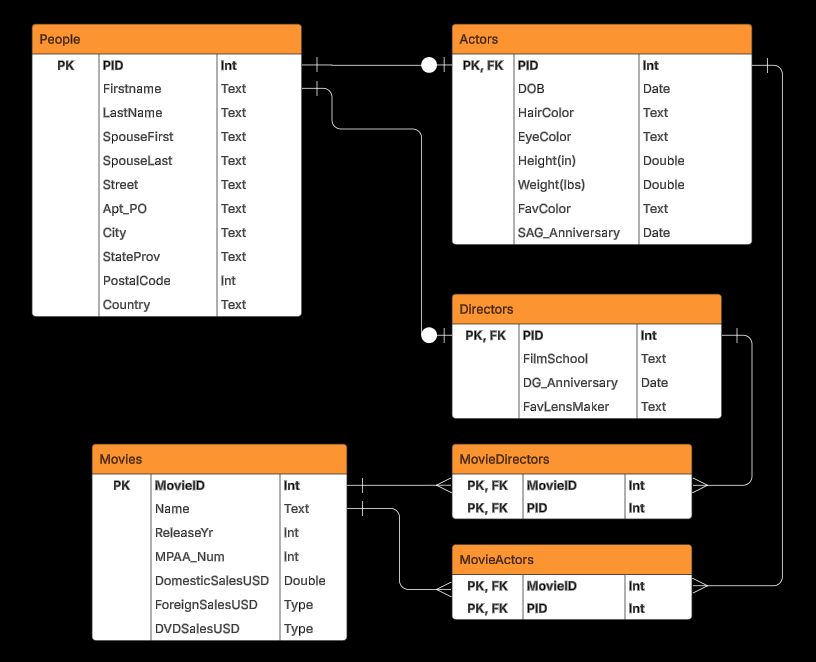

# Database Lab Report 8

**Course:** Database Management\
**Lab Number:** *Lab #8*\
**Date:** *2025-4-15*\
**Name:** *Ryan Munger*

---

## 1. Objective

*To continue developing your facility with the art and science of normalization*

## 2. Lab Setup

*A normalized brain*

## 3. Procedure

### Prompt: 

*You have been hired as a database consultant by EON productions to work in the casting department for the next James Bond film. They finally need a new Bond (thank Codd!) and want a database of actors, the movies in which they have appeared, and the director of those movies. They have collected the following data for your use:*

**Actor Data:** \
name, address, birth date, hair color, eye color, height in inches, weight, spouse name, 
favorite color, screen actors guild anniversary date

**Movie Data** \
name, year released, MPAA number, domestic box office sales, foreign box office sales, 
DVD/Blu-ray sales

**Director Data** \
name, address, spouse name, film school attended, directors guild anniversary date, 
favorite lens maker

### Part 1:
*Build this database. You may add or rename any fields you like. You must create a relational database in Boyce-Codd normal form (BCNF).* 


​1.  **Create a fully decorated and aesthetically beautiful E/R diagram**


\
2. **Write SQL create statements for each table**

Test Data is available in create-script.sql
```sql
CREATE TABLE People (
    PID INT NOT NULL,
    FirstName TEXT NOT NULL,
    LastName TEXT NOT NULL,
    SpouseFirst TEXT,
    SpouseLast TEXT,
    Street TEXT,
    Apt_PO TEXT,
    City TEXT,
    StateProv TEXT,
    PostalCode TEXT,
    Country TEXT,
  PRIMARY KEY (PID)
);

CREATE TABLE Actors (
    PID INT NOT NULL REFERENCES People(PID) ON DELETE CASCADE,
    DOB DATE,
    HairColor TEXT,
    EyeColor TEXT,
    Height_in DOUBLE PRECISION CHECK (Height_in > 0),
    Weight_lbs DOUBLE PRECISION CHECK (Weight_lbs > 0),
    FavColor TEXT,
    SAG_Anniversary DATE,
  PRIMARY KEY (PID)
);

CREATE TABLE Directors (
    PID INT NOT NULL REFERENCES People(PID) ON DELETE CASCADE,
    FilmSchool TEXT,
    DG_Anniversary DATE,
    FavLensMaker TEXT,
  PRIMARY KEY (PID) 
);

CREATE TABLE Movies (
    MovieID INT NOT NULL,
    Title TEXT NOT NULL,
    ReleaseYr INT CHECK (ReleaseYr >= 1888), -- first ever movie
    MPAA_Num INT NOT NULL,
    DomesticSalesUSD DOUBLE PRECISION CHECK (DomesticSalesUSD >= 0),
    ForeignSalesUSD DOUBLE PRECISION CHECK (ForeignSalesUSD >= 0),
    DVDSalesUSD DOUBLE PRECISION CHECK (DVDSalesUSD >= 0),
  PRIMARY KEY(MovieID)
);

CREATE TABLE MovieActors (
    MovieID INT NOT NULL REFERENCES Movies(MovieID) ON DELETE CASCADE,
    PID INT NOT NULL REFERENCES Actors(PID) ON DELETE CASCADE,
    PRIMARY KEY (MovieID, PID)
);

CREATE TABLE MovieDirectors (
    MovieID INT NOT NULL REFERENCES Movies(MovieID) ON DELETE CASCADE,
    PID INT NOT NULL REFERENCES Directors(PID) ON DELETE CASCADE,
    PRIMARY KEY (MovieID, PID)
);

```

\
3. **List the functional dependencies for each table.** 

**People Table:**

PID → FirstName, LastName, SpouseFirst, SpouseLast, Street, Apt_PO, City, StateProv, PostalCode, Country

Reasoning: PID, the primary key, uniquely identifies each person as well as determines all attributes of that person.

**Actors Table:**

PID → DOB, HairColor, EyeColor, Height_in, Weight_lbs, FavColor, SAG_Anniversary
        
Reasoning: PID, the primary key (which is also a foreign key referencing People), uniquely identifies actors and determines all of their attributes.

**Directors Table:**

PID → FilmSchool, DG_Anniversary, FavLensMaker
        
Reasoning: PID, the primary key (which is also a foreign key referencing People) uniquely identifies each director and all of their attributes.

**Movies Table:**

MovieID → Title, ReleaseYr, MPAA_Num, DomesticSalesUSD, ForeignSalesUSD, DVDSalesUSD
        
Reasoning: MovieID, the primary key, uniquely identifies each movie as well as determines all other attributes.

**MovieActors Table:**

MovieID, PID → *Nothing*

Reasoning: The combination of MovieID and PID (together they make the primary key) uniquely identifies the relationship between a movie and an actor. There are no other attributes present.

**MovieDirectors Table:**

MovieID, PID → *Nothing*

Reasoning: The combination of MovieID and PID (together they make the primary key) uniquely identifies the relationship between a movie and a director. There are no other attributes present.

\
4. **Write a query to show all the directors with whom actor “Roger Moore” has worked.**

I tested this query with Sean Connery from my test data. Don't worry, I didn't dox their addresses.
```sql
SELECT p.firstName || ' ' || p.lastName AS fullName, p.city, p.country, d.filmSchool, d.dg_anniversary, d.favLensMaker
FROM People p INNER JOIN Directors d ON p.pid = d.pid
WHERE d.pid IN (
      SELECT pid 
      FROM MovieDirectors
      WHERE movieID IN (
            SELECT movieID
            FROM MovieActors 
            WHERE pid IN (
                  SELECT pid 
                  FROM People
                  WHERE firstName = 'Roger' AND lastName = 'Moore'
                         )
                       )
                )
ORDER BY fullName ASC;
```