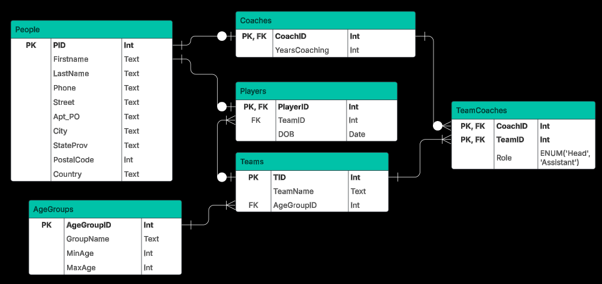

# Database Lab Report 9

**Course:** Database Management\
**Lab Number:** *Lab #9*\
**Date:** *2025-4-22*\
**Name:** *Ryan Munger*

---

## 1. Objective

*To continue developing your facility with the art and science of normalization*

## 2. Lab Setup

*A normalized brain*

## 3. Procedure

### Prompt: 

*You have been captured by Star Helix Security and tasked with designing a database for the Belters Little League Sports Alliance on Ceres Station. Here are some facts:*

* The league consists of many teams spread over three age groups.
* The three age groups are as follows: under 10, 10 through 14, over 14
* Each team plays in exactly one age group.
* A team consists of many players, one or more assistant coaches, and one head coach.
* We have first and last names, addresses, and phone numbers for all players and coaches.
* For all coaches we need know the number of years they have been coaching.
* A player can play on only one team.
* A coach can coach several teams as long as each team is in a different age group.

### Part 1:
*Build this database. You must create a relational database in at least 3NF (even better - BCNF).* 

**​1. List the functional dependencies for each table.**

**People Table:**

PID → FirstName, LastName, Phone, Street, Apt_PO, City, StateProv, PostalCode, Country

Reasoning: PID, the primary key, uniquely identifies each person as well as determines all attributes of that person.

 

**Coaches Table:**

CoachID → YearsCoaching

Reasoning: CoachID, the primary key (which is also a foreign key referencing PID from the people table) uniquely identifies each coach and their years coaching.

 

**Players Table:**

PlayerID → TeamID, DOB

Reasoning: PlayerID, the primary key (which is also a foreign key referencing PID from the people table) uniquely identifies each player, their age, and what team they are on (nullable).

 

**Teams Table:**

TID → TeamName, AgeGroupID

Reasoning: TID, the primary key uniquely identifies each team, its name, and its grouping.

 

**TeamCoaches Table:**

(CoachID, TeamID) → Role

Reasoning: The combination of CoachID and TeamID, the primary key (the components of which are foreign keys referencing CoachID from the coaches table and TID from the teams table, respectively) uniquely identifies each coach on a team and their role on that team.

 

**AgeGroups Table:**

AgeGroupID → GroupName, MinAge, MaxAge

Reasoning: AgeGroupID, the primary key, uniquely identifies each age group, its name, and its age max/min. 

 

**Other Constraints**

1. Players must be within the age range of the ageGroup in which their team plays.
2. A team can only have one head coach.
3. A coach can coach several teams only when the age groups for those teams are different.
4. TeamCoaches' rows must be unique. 

\
**2. Draw a fully annotated E/R diagram using LucidChart that illustrates the Platonic ideal of beautiful and correct relational database design.**

\
**3. Convince me that your database is in 3NF (or even better, in BCNF).**

* This database is 1NF because all fields are atomic. 
* This database is 2NF because there are no partial dependencies (all non-key attributes are fully dependent on the whole primary key - we saw this when listing functional dependencies). 
* This database is 3NF because it has no transitive dependencies, meaning that no non-key attributes are dependent on a different non-key attribute. We can once again justify this by looking at the functional dependencies. 
* Finally, this database is also BCNF. For every dependency X → Y, X is a superkey. This protects us from redundancy and update anomalies. Once again, this is justified by the functional dependencies (I see why we had to list them out now), as everything that determines another field is a primary key.