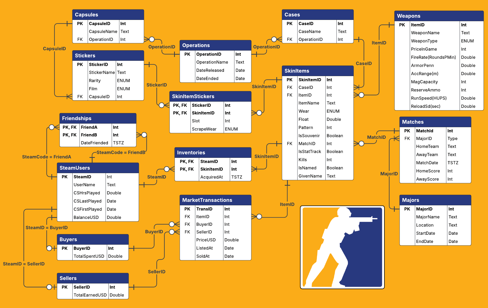

# Database Management

If you are browsing in GitHub, the markdown file is recommended for viewing. Otherwise, all writeups are also available as a pdf. 

# Content
This repository contains projects pertaining to the fundamental areas of database management such as:
* Entity Relationship Diagrams
* SQL
  * Queries
  * Views
  * Stored Procedures
  * Indexes
  * Triggers
  * Security (Users, Groups, Grant/Revoke)
  * Create Statements
* Normalization (Up to BCNF!)
* Database Design & Administration
* Relational & Graph Databases

## Final Project
My final project in this course was to design a database for the CounterStrike item marketplace.

  

# In this course I:

* Came to understand that data has value, and the right answer is
infinitely better than a fast answer.
* Reached a solid knowledge of and appreciation for principles and
foundations of relational and graph database systems.
* Gained an understanding of relational database concepts, terminology,
and their superiority over NoSQL garbage like document stores.
* Attained in-depth knowledge of the relational data model and why it’s
superior to other data models in general, and will remain so.
* Appreciated, understood, used, and basked in awe of SQL.
* Appreciated, understood, and basked in awe of graphs.
* Designed, implemented, tested, and documented a BCNF relational database.
* Discussed and used new database technology.
* Came to know some modern graph data techniques and technologies
* Developed continuing education skills. Capable problem solvers never
stop learning. 
